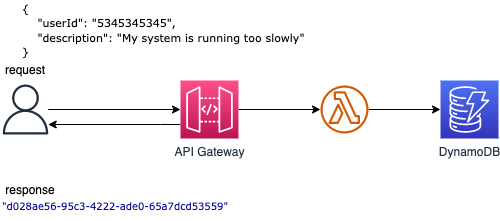

## API Gateway, Lambda Function and Dynamodb Table

This pattern creates an Amazon API Gateway HTTP API, an AWS Lambda function and a DynamoDB Table using SAM and Java 11.

Important: this application uses various AWS services and there are costs associated with these services after the Free Tier usage - please see the AWS Pricing page for details. You are responsible for any AWS costs incurred.

## Language: This is a Maven project which uses Java 11 and AWS SDK

## Framework (currently we support SAM or CDK)

## Services used (e.g. "Lambda to EventBridge)

## Description 
The SAM template contains all the information to deploy AWS resources(an API Gateway, an Lambda function and a DynamoDB table) and also the permission required by these service to communicate.

You will be able to create and delete the CloudFormation stack using the CLI commands.

After the stack is created you can send an JSON object using curl or Postman to the URL provided by the API Gateway,
the request will be intercepted by the Lambda function which will persist the object into a DynamoDB table.

The lambda function will return the ID of the inserted object.

Topology

## Deployment commands

## GitHub PR for template: 

## Additional resources (optional: link and anchor text, up to 5 resources)

## Author bio 
Name:
Photo URL:
Twitter handle:
Description (up to 255 chars):

